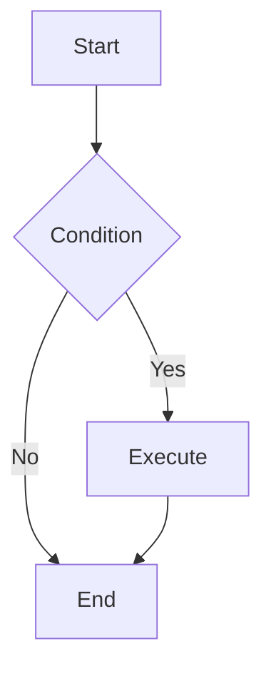

# Markdown Syntax Guide

This document introduces common Markdown syntax to help you get started with writing documentation quickly.

## Headers

Use `#` to denote headers level 1-6.

```markdown
# Header 1

## Header 2

### Header 3

#### Header 4

##### Header 5

###### Header 6
```

## Emphasis

- **Bold**: Use `**` or `__` to wrap text.
- _Italic_: Use `*` or `_` to wrap text.
- ~~Strikethrough~~: Use `~~` to wrap text.

```markdown
**Bold Text**
_Italic Text_
~~Strikethrough Text~~
```

## Lists

### Unordered List

Use `*`, `+`, or `-` as list markers.

```markdown
- Item 1
- Item 2
  - Sub-item 2.1
  - Sub-item 2.2
```

### Ordered List

Use numbers followed by a `.`.

```markdown
1. First Item
2. Second Item
3. Third Item
```

## Blockquotes

Use `>` for blockquotes.

```markdown
> This is a blockquote.
>
> > This is a nested blockquote.
```

## Code

### Inline Code

Use backticks \` to wrap code.

```markdown
Use `console.log()` to output logs.
```

### Code Blocks

Use three backticks \`\`\` to wrap code blocks, and specify the language.

````markdown
```javascript
function hello() {
  console.log('Hello, world!');
}
```
````

## Links & Images

### Links

```markdown
[Link Text](https://www.example.com)
```

### Images

```markdown

```

## Tables

Use `|` to separate cells, and `-` to separate headers and content.

```markdown
| Header 1   | Header 2 |    Header 3 |
| :--------- | :------: | ----------: |
| Left Align |  Center  | Right Align |
| Content    | Content  |     Content |
```

## Horizontal Rules

Use three or more `-`, `*`, or `_`.

```markdown
---
```

## Task Lists

```markdown
- [x] Completed task
- [ ] Incomplete task
```

## Alerts

Use `:::` syntax to create different types of alert blocks.

```markdown
:::info
This is an info alert.
:::

:::warning
This is a warning alert.
:::

:::success
This is a success alert.
:::

:::error
This is an error alert.
:::
```

## Charts

### Mermaid Charts

Supports using Mermaid syntax to draw flowcharts, sequence diagrams, Gantt charts, etc.

````markdown

````

### Embedded Components

You can use React components (MDX) directly in Markdown, such as Ant Design components.

```markdown
import { Card } from 'antd';

<Card title="Card Title">
  Card Content
</Card>
```

### Advanced Table Configuration

You can configure a normal Markdown table as an advanced table using the HTML comment `<!-- { "chartType": "table" } -->`.

```markdown
<!-- {"chartType": "table"} -->

| Name     | Age | Occupation |
| :------- | :-- | :--------- |
| John Doe | 28  | Engineer   |
| Jane Doe | 32  | Designer   |
```

### Other Chart Types

Similarly, supports rendering various chart types, such as bar charts (`bar`), pie charts (`pie`), etc.

```markdown
<!-- {"chartType": "bar", "x": "Product", "y": "Sales"} -->

| Product | Sales |
| :------ | :---- |
| A       | 100   |
| B       | 150   |
| C       | 80    |
```

## Advanced Custom Components (aPaaSify)

Supports using `apaasify` code blocks to define schema-based advanced components, suitable for custom rendering in aPaaS scenarios.

````markdown
```apaasify
{
  "type": "page",
  "body": [
    {
      "type": "button",
      "label": "Click Me"
    }
  ]
}
```
````

> **Note**: The content of the `apaasify` code block is usually a JSON object, and the specific field structure depends on the project's custom renderer configuration.
