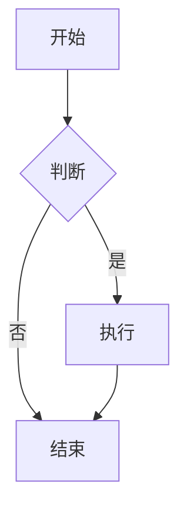

# Markdown 语法指南

本文档介绍了常用的 Markdown 语法，帮助你快速上手编写文档。

## 标题 (Headers)

使用 `#` 号可表示 1-6 级标题。

```markdown
# 一级标题
## 二级标题
### 三级标题
#### 四级标题
##### 五级标题
###### 六级标题
```

## 强调 (Emphasis)

*   **加粗**：使用 `**` 或 `__` 包裹文本。
*   *斜体*：使用 `*` 或 `_` 包裹文本。
*   ~~删除线~~：使用 `~~` 包裹文本。

```markdown
**加粗文本**
*斜体文本*
~~删除线文本~~
```

## 列表 (Lists)

### 无序列表

使用 `*`、`+` 或 `-` 作为列表标记。

```markdown
- 项目 1
- 项目 2
  - 子项目 2.1
  - 子项目 2.2
```

### 有序列表

使用数字并加上 `.` 号。

```markdown
1. 第一项
2. 第二项
3. 第三项
```

## 引用 (Blockquotes)

使用 `>` 表示引用。

```markdown
> 这是一个引用块。
>
> > 这是一个嵌套的引用块。
```

## 代码 (Code)

### 行内代码

使用反引号 `` ` `` 包裹代码。

```markdown
使用 `console.log()` 输出日志。
```

### 代码块

使用三个反引号 \`\`\` 包裹代码块，并可指定语言。

````markdown
```javascript
function hello() {
  console.log('Hello, world!');
}
```
````

## 链接与图片 (Links & Images)

### 链接

```markdown
[链接文本](https://www.example.com)
```

### 图片

```markdown

```

## 表格 (Tables)

使用 `|` 分隔单元格，使用 `-` 分隔表头和内容。可以在分隔行上使用 `:` 来设置列的对齐方式。

```markdown
| 标题 1 | 标题 2 | 标题 3 |
| :--- | :---: | ---: |
| 左对齐 | 居中 | 右对齐 |
| 内容 | 内容 | 内容 |
```

## 分割线 (Horizontal Rules)

使用三个或以上的 `-`、`*` 或 `_`。

```markdown
---
```

## 任务列表 (Task Lists)

```markdown
- [x] 已完成任务
- [ ] 未完成任务
```

## 提示块 (Alerts)

使用 `:::` 语法可以创建不同类型的提示块。

```markdown
:::info
这是一个信息提示块。
:::

:::warning
这是一个警告提示块。
:::

:::success
这是一个成功提示块。
:::

:::error
这是一个错误提示块。
:::
```

## 图表 (Charts)

### Mermaid 图表

支持使用 Mermaid 语法绘制流程图、时序图、甘特图等。

````markdown

````

### 内嵌组件

你可以在 Markdown 中直接使用 React 组件（MDX），例如 Ant Design 的组件。

```markdown
import { Card } from 'antd';

<Card title="卡片标题">
  卡片内容
</Card>
```

### 高级表格配置

通过 HTML 注释 `<!-- { "chartType": "table" } -->` 可以将普通的 Markdown 表格配置为高级表格。

```markdown
<!-- {"chartType": "table"} -->

| 姓名 | 年龄 | 职业 |
| :--- | :--- | :--- |
| 张三 | 28 | 工程师 |
| 李四 | 32 | 设计师 |
```

### 其他图表类型

同样的方式支持渲染多种图表，例如柱状图 (`bar`)、饼图 (`pie`) 等。

```markdown
<!-- {"chartType": "bar", "x": "产品", "y": "销量"} -->

| 产品 | 销量 |
| :--- | :--- |
| A | 100 |
| B | 150 |
| C | 80 |
```

## 高级自定义组件 (aPaaSify)

支持使用 `apaasify` 代码块来定义基于 Schema 的高级组件，适用于 aPaaS 场景下的自定义渲染。

````markdown
```apaasify
{
  "type": "page",
  "body": [
    {
      "type": "button",
      "label": "点击我"
    }
  ]
}
```
````

> **注意**：`apaasify` 代码块的内容通常是一个 JSON 对象，具体的字段结构取决于项目的自定义渲染器配置。
